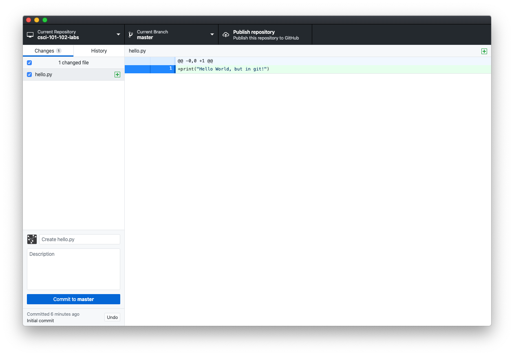
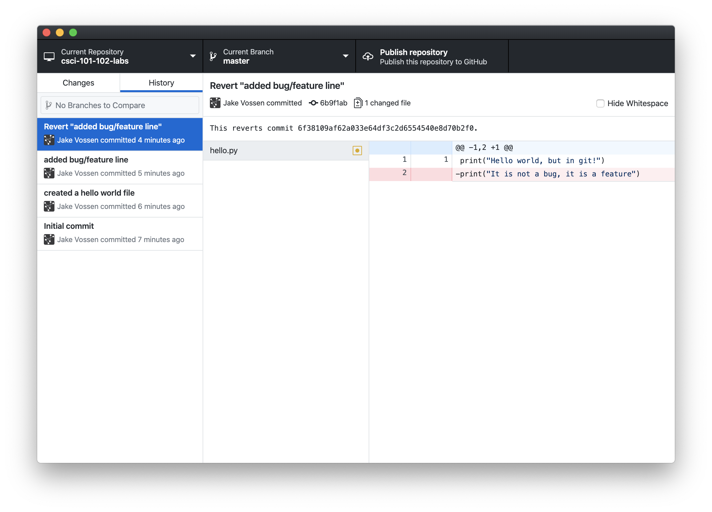

# 102-git-workshop

## Week 1 Assignment

### Installing GitHub Desktop

`git` is the name of the tool itself, but there are many application  that add a gui on top of `git`.
Because `git` is very visual, using a frontend will make it much easier for us to understand what is going on.
There are many frontends for `git` (such as [gitkraken](https://www.gitkraken.com/), [fork](https://git-fork.com/), and [TortoiseGit](https://tortoisegit.org/)).
For this tutorial, we are going to be using [Github Desktop](https://desktop.github.com/).

1. If you do not have one already, create an account on GitHub by going to [github.com](github.com) and clicking on "Sign up" in the upper right hand corner. I suggest using your personal email, so you can keep projects that are not for school here as well.
1. Install GitHub Desktop by going to [https://desktop.github.com/](https://desktop.github.com/).
1. After opening GitHub Deskop, sign into your GitHub account
1. You can configure how you would like to appear, but I suggest keeping the defaults.

### Creating your First Repo

Now that you have the GitHub Desktop application installed, we are going to create our first repository!

> Note, currently, this will **just** are repository local to your computer.
> Even though this tool is called "GitHub Desktop" your code is **not** on GitHub, that will be another step down the line.

On **macOS**, go to File -> New Repository...

On **Windows** TODO what do you do on windows

1. Naming is up to you, but later on we are going to be adding our old 101 / 102 labs, so I suggest something like `csci-101-102-labs`.
1. Change the Local Path to something you can easily find - I suggest the Desktop for this project
1. Check the box next to 'Initialize this project with a README'
1. Select `Python` under the 'Git Ignore' - we will talk more about `git` ignore files more next week

In the end, your repository should look like this:


Change the local path if desired, and hit "Create Repository"!

### Creating Files in our Repo

You should have a new folder named `csci-101-102-labs` in wherever you created the repository with a file called `READEME.md` in it.
This is just like any folder on our computer, and we can add any files to it.
However, we are typically dealing with code in our `git` repository, so lets create a simple Python program to add to our `git` repo.

1. Open IDLE and create a new Python program
1. Add the contents `print("Hello world, but in git!")` the file
1. Save the file into where the repository was created, naming it `hello.py`
1. Verify that you have two files (`hello.py`, `README.md`) inside a folder titled `csci-101-102-labs`

As you can see, this folder is just like other folders on your computer, but `git` is keeping tack of some things for you behind the scenes

### Seeing our changes in GitHub Desktop

Navigate back to the GitHub Desktop application, your screen should look something like this:



There are a number of different views we can see here

* The 'main' view on the left that shows the difference between your changes and the last commit
* The files you have changed on the left. The checkbox being checked means the file is **staged** and will be a part of the next commit. Selecting a file here will bring it into the main view, and you can see the changes made to that file
* The bottom left is where you add a message and optional description to your commit

#### Committing

We can go ahead and 'commit' our change. This means that `git` will remember what the files look like in our repository at this snapshot in time.
Put your commit message in the box that currently says "Create hello.py".
This message should be something that is useful for future programmers who have to analyze it.
You can put any text here, I would suggest something like "created a hello world file".
Then, go ahead and hit the "Commit to master".
You should now see "no local changes" in your GitHub Desktop.

### Making changes

Go back to your `hello.py` file and add a second line that prints 'It is not a bug, it is a feature'.
Your `hello.py` should look like this now:

```python
print("Hello world, but in git!")
print("It is not a bug, it is a feature")
```

Back on GitHub Desktop, your screen should look like this


Here we can see what is called a **diff** view, and compare the changes we have made since our last commit.
Go ahead and give this a descriptive commit message, and commit to master.

### Reverting changes

Down the line, it turns out that the change you just made is destroying the production database.
Luckily, because we are using `git`, we can easily revert to any version of our software, so we can revert it to a known working state.

1. Because we are going to be modifying the `hello.py` via `git`, close `hello.py` from IDLE
1. Go to the "History" tab on the left hand side of GitHub Desktop
1. Right click on the most recent commit, it should be the one that added the `print("it is not a bug, it is a feature")`
1. Click on "Revert this Commit"

You should see a new commit added to the history that says "Revert (your commit message here)". In order to revert a commit, `git` creates a new commit that is the 'opposite' of the commit you want to revert.



Now, you can open `hello.py` again in IDLE, and you should see that it is back to just `print("Hello world, but in git!")`.

## Week 2 Assignment
