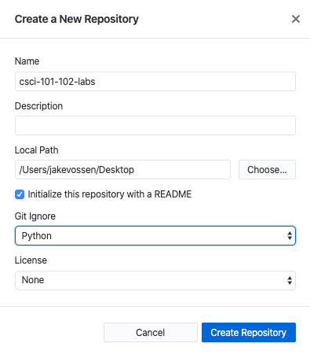
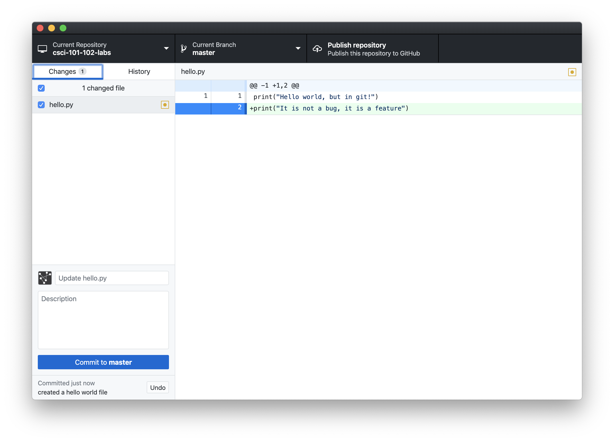
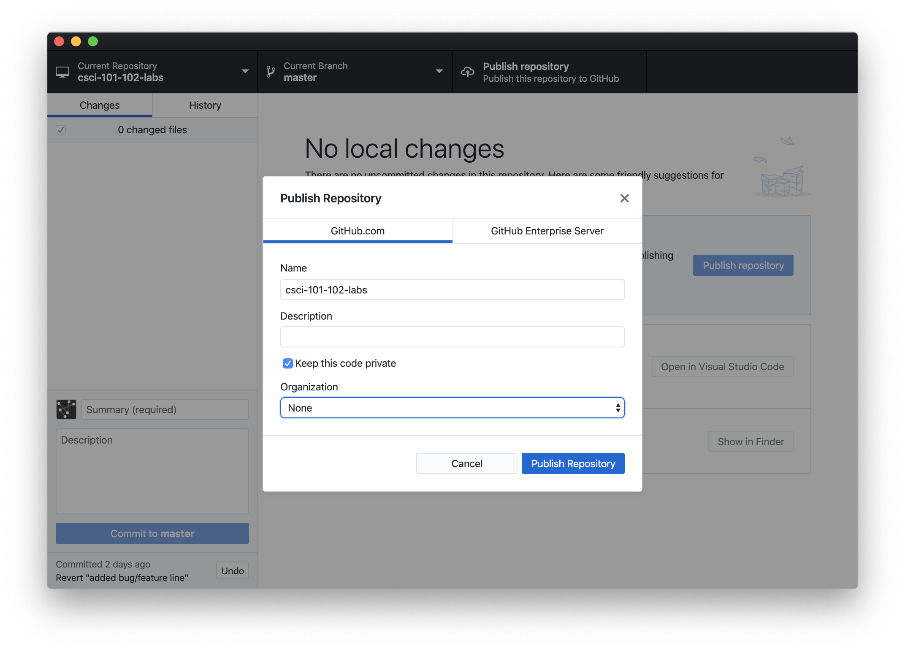
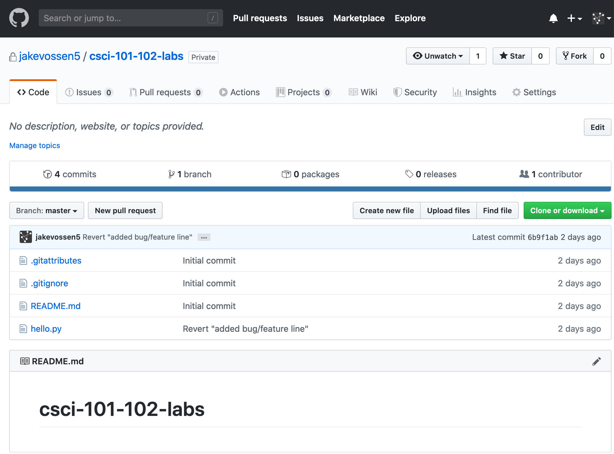
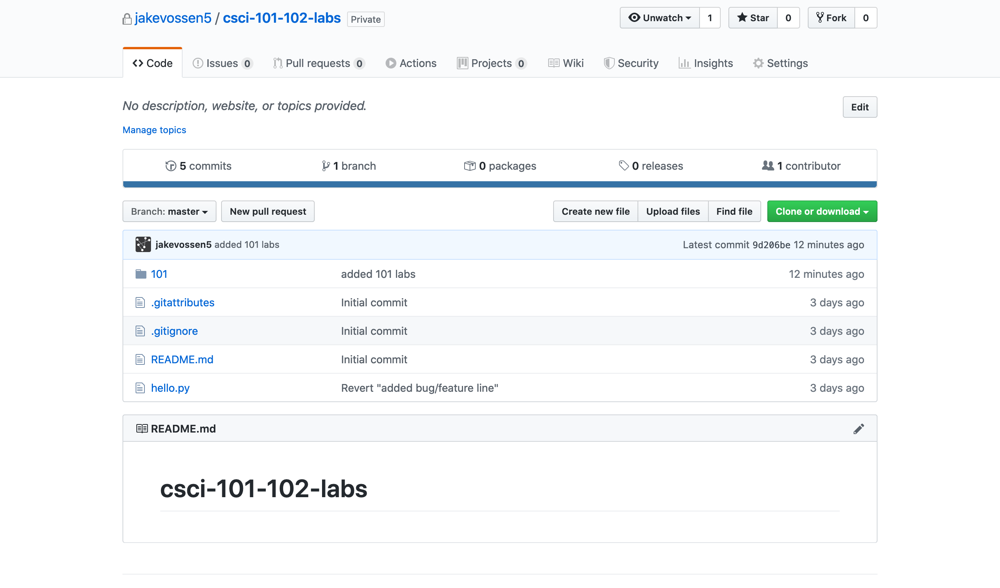
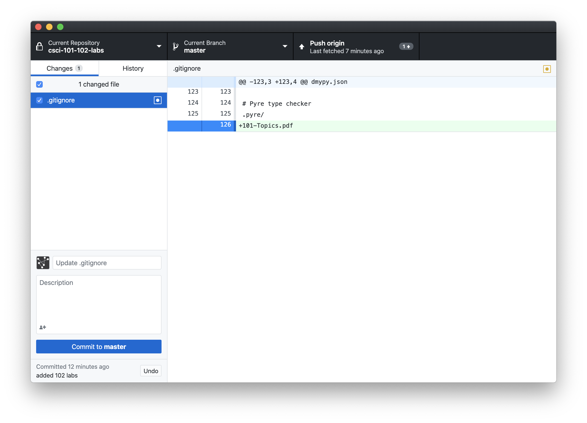

# 102-git-workshop

## Week 1 Assignment

### **FOR PEOPLE WHO ALREADY KNOW GIT**

If you have a lot of experience using the `git` command line and don't want to learn a new client, you can follow along with this lab and submit a `git log > gitlog.txt` instead of a screenshot.
If that means nothing to you, you should probably use GitHub Desktop!

### Installing GitHub Desktop

`git` is the name of the tool itself, but there are many applications that add a gui (graphical user interface) on top of `git`.
Because `git` is very visual, using a front-end will make it much easier for us to understand what is going on.
There are many front-ends for `git` (such as [gitkraken](https://www.gitkraken.com/), [fork](https://git-fork.com/), and [TortoiseGit](https://tortoisegit.org/)).
For this tutorial, we are going to be using [Github Desktop](https://desktop.github.com/).

1. If you do not have one already, create an account on GitHub by going to [github.com](github.com) and clicking on "Sign up" in the upper right hand corner. I suggest using your personal email, so you can keep projects that are not for school here as well.
1. Install GitHub Desktop by going to [https://desktop.github.com/](https://desktop.github.com/).
1. After opening GitHub Deskop, sign into your GitHub account
1. You can configure how you would like to appear, but I suggest keeping the defaults.

### Creating your First Repo

Now that you have the GitHub Desktop application installed, we are going to create our first repository!

> Note, currently, this will **just** create a repository local to your computer.
> Even though this tool is called "GitHub Desktop" your code is **not** on GitHub, that will be another step down the line.

1. Open GitHub Desktop from where you downloaded / installed it to
1. File -> New Repository...
1. Naming is up to you, but later on we are going to be adding our old 101 / 102 labs, so I suggest something like `csci-101-102-labs`.
1. Change the Local Path to something you can easily find - I suggest the Desktop for this project
1. Check the box next to 'Initialize this project with a README'
1. Select `Python` under the 'Git Ignore' - we will talk more about `git` ignore files more next week

In the end, your repository should look like this:



Change the local path if desired, and hit "Create Repository"!

### Creating Files in our Repo

You should have a new folder named `csci-101-102-labs` in wherever you created the repository with a file called `READEME.md` in it.
This is just like any folder on our computer, and we can add any files to it.
However, we are typically dealing with code in our `git` repository, so lets create a simple Python program to add to our `git` repo.

1. Open IDLE and create a new Python program
1. Add the contents `print("Hello world, but in git!")` the file
1. Save the file into where the repository was created, naming it `hello.py`
1. Verify that you have two files (`hello.py`, `README.md`) inside a folder titled `csci-101-102-labs`

As you can see, this folder is just like other folders on your computer, but `git` is keeping tack of some things for you behind the scenes

### Seeing our changes in GitHub Desktop

Navigate back to the GitHub Desktop application, your screen should look something like this:


There are a number of different views we can see here

* The 'main' view on the right that shows the difference between your changes and the last commit
* The files you have changed on the left. The checkbox being checked means the file is **staged** and will be a part of the next commit. Selecting a file here will bring it into the main view, and you can see the changes made to that file
* The bottom left is where you add a message and optional description to your commit

#### Committing

We can go ahead and 'commit' our change. This means that `git` will remember what the files look like in our repository at this snapshot in time.
1. Put your commit message in the box that currently says "Create hello.py". This message should be something that is useful for future programmers who have to analyze it. You can put any text here, I would suggest something like "created a hello world file".
1. Then, go ahead and hit the "Commit to master". 

You should now see "no local changes" in your GitHub Desktop.

### Making changes

Go back to your `hello.py` file and add a second line that prints 'It is not a bug, it is a feature'.
Your `hello.py` should look like this now:

```python
print("Hello world, but in git!")
print("It is not a bug, it is a feature")
```

Back on GitHub Desktop, your screen should look like this



Here we can see what is called a **diff** view, and compare the changes we have made since our last commit.
Go ahead and give this a descriptive commit message, and commit to master.

### Reverting changes

Down the line, it turns out that the change you just made is destroying the production database.
Luckily, because we are using `git`, we can easily revert to any version of our software, so we can revert it to a known working state.

1. Because we are going to be modifying the `hello.py` via `git`, close `hello.py` from IDLE
1. Go to the "History" tab on the left hand side of GitHub Desktop
1. Right click on the most recent commit, it should be the one that added the `print("it is not a bug, it is a feature")`
1. Click on "Revert this Commit"

You should see a new commit added to the history that says "Revert (your commit message here)". In order to revert a commit, `git` creates a new commit that is the 'opposite' of the commit you want to revert.


Now, you can open `hello.py` again in IDLE, and you should see that it is back to just `print("Hello world, but in git!")`.

### Submission for Week 1

Please submit canvas a screenshot of the history page.

If you used the `git` command line, you can run `git log > gitlog.txt` and submit the resulting text file.

## Week 2 Assignment

<!-- Goals:
Creating / pushing to remote repository
Not commit certain files / staging
Add gitignore -->

Now that we have our git repository local to our computer, the next step is going to be making it available via GitHub.
Because we are using GitHub desktop, this will be really easy!

1. If you don't have it open already, open GitHub desktop. If the repository we created last week is not what is listed in the very top left, click on it and select the name of the repo you created last week.
1. On the top menu bar, click on the option that says "Publish this Repository"
1. All of the default settings should be fine, but it is **very** important that your code is **private**, because we will be uploading our 101 and 102 labs to here



Go ahead and click on "Publish Repository" now.

We are going to view our code on the GitHub website.
This will make it clear what is on our local repo, and what has been pushed to master.
You can do this by navigating to `https://github.com/<yourusername>/csci-101-102-labs`.
Right now, it should look identical to what you have to the code in your local repository.
If you try and visit it and you get a "page not found error", sign into GitHub and try again.
It should look something like this.



### Adding our Python Code

So we have a large number of files to work with, we are going to be adding our old 101 and 102 labs to this local repository.

1. Create two folders, a `101` and a `102` folder from Finder / File explorer
1. Move your 101 labs to the 101 folder, and your 102 labs to your 102 folder
1. Open GitHub Desktop
1. Select all of your **101** labs only on the left hand side (remember, what is selected is what is staged for commit)
1. In the commit summary area, write something like 'added 101 labs'
1. Verify that your GitHub Desktop looks something similar to mine. I don't have all of the 101 and 102 labs, so the number of files / the name of your files should vary from mine.


Lets stop a minute and think about what we do before we hit 'commit to master'.
As we discussed earlier, committing creates a snapshot of our files look like at this current time.
This means that the content of the files that we have staged right now are going to be saved by `git` forever.
With that being said, go ahead and press 'commit to master'

### Syncing with GitHub

Sign back into GitHub and go to your `csci-101-102-labs` repository.
Look at the files are there. Are they what you expected?
They should not have changed since the last time you looked at GitHub, this is because when we commit we are **only making changes to our local repository**

How do we make our code available on GitHub?
This is called pushing.
You can push to GitHub from GitHub Desktop by pressing the "Push origin" on the top bar.

Now, refresh `github.com/<yourusername>/csci-101-102-labs`.
You should see something like this.



Take a few minutes and think about what this means.
Our `101` folder is here, but our `102` folder is not.
This is because we only commited the changes to our `101` folder.

### Trying it on your own

1. On your own, add your 102 labs, commit, and push.
1. Verify that what you see at `github.com/<yourusername>/csci-101-102-labs` is the same as what you see on GitHub Desktop, and you have no uncommitted changes on the left.

### Using a `.gitignore`

What should we do about files that are in our repository but we don't want `git` to ever commit them?
Sure, we can make sure that we never check the check box in GitHub Desktop, but that is annoying, and maybe you have a lot of files / a whole folder you want to ignore.

> Side note: in practice, this is most often used to stop having binary files in your `git` repository.
> Binary files are the name for the actual machine code instructions for your computer runs when you run a program.
> `git` works because it just tracks the difference between files, but because binary files are not plain text, `git` would have to save the binary exactly as you generated it each time.
> This will quickly make our `git` repositories become very large, and theoretically the source code should contain everything needed to generate that binary anyways, so it is not adding any additional information.
> Because Python is an [interpreted](https://en.wikipedia.org/wiki/Interpreted_language) language, it creates no binaries.

In this scenario, we want to put the 101 course topics in the same folder but we don't want it to be part of our `git` repository (in reality a small PDF is not a concerning thing to have in a `git` repository)

1. Download the 101 course topics [here](http://cs-courses.mines.edu/csci101/static/101-Topics.pdf)
1. Place that PDF in your `csci-101-102-labs` folder on your computer
1. Open GitHub Desktop, and open the repository if it is not open already
1. You should see the PDF on the left sidebar of GitHub Desktop. Right click on it and select "ignore file". Notice how GitHub Desktop allows you to ignore all PDFs if we wanted to.

Your GitHub Desktop should now look something like this:



Now, you can see that GitHub Desktop modified out `.gitignore` for us.
A `.gitignore` is a plain text file that tells `git` which files not to ever track.
By adding `101-Topics.pdf`, `git` will ignore any file with that exact name.
If you remember when we first created this repository, we asked GitHub Desktop to use a Python `.gitignore` for us, which is why there are other lines in this file.

`.gitignore` is a file that is tracked by `git`, so lets go ahead and commit with some message similar to "added 101 topics to the gitignore", then push.

Now, go to GitHub and look at what files GitHub has.
Note that this does not include the `101-Topics.pdf`.
If someone where to come and download your repository, `101-Topics.pdf` would not be downloaded with it - it only exists on your own computer.

#### When to add something to your `.gitignore`

There is not 100% guide for when to add something to your `.gitignore`, but here are some rules of thumbs that I find usefull.

* If it is a file that can be generated completly from other files, aka output files
* If it is a large binary file that is frequently changing
* Temporary / other generated files

In general, if you select the `.gitignore` when creating your repository for the language you are using (if you forget you can download them here: [https://github.com/github/gitignore](https://github.com/github/gitignore)), you should typically be okay.
Nothing you do in CSCI 101 or 102 is heavy enough that you have to worry about the sizes of your `git` repositories.

### Submission for Week 2

Please submit canvas a screenshot of the history page.

If you used the `git` command line, you can run `git log > gitlog.txt` and submit the resulting text file.
